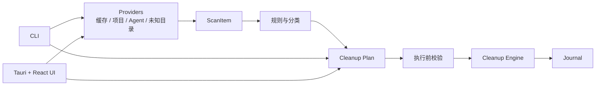

# DevResidue

**面向 Windows 开发者与 AI Coding Agent 用户的本地开发数据管理工具。**

DevResidue 用于识别、分类、预览并谨慎管理开发环境中不断积累的存储残留：AI Agent 数据、开发工具缓存、包管理器缓存、项目构建产物、临时 clone / worktree，以及难以判断用途的开发目录。

它的目标不是尽可能多地删除文件，而是帮助你理解：**哪些数据可以清理、为什么可以清理，以及如何以受控方式清理。**

> [!IMPORTANT]
> DevResidue 是 **Developer Storage Manager**，不是系统垃圾清理器。它不处理 Windows Update、注册表、浏览器数据、系统服务、驱动或“一键优化 Windows”等系统级清理任务。

## 当前状态

项目当前处于开发阶段（workspace 版本 `0.1.0`），尚未提供正式安装包、签名发布物或 GUI 打包版本。建议从源码构建并先使用 `--dry-run` 熟悉扫描和清理流程。

## 解决的问题

开发环境中的空间占用通常来自多个独立来源：

- **AI Coding Agent 数据**：如 Codex、Claude Code、OpenCode、Oh My OpenCode Slim、Cursor、Windsurf 产生的缓存、日志、会话和工作区状态；
- **开发工具与包管理器缓存**：例如 npm、Bun、pip、uv、Cargo、NuGet 等缓存目录；
- **项目残留**：多语言、多构建系统项目留下的可重建构建产物、临时 clone、worktree 与其他开发目录；
- **未知开发目录**：位于用户目录下、以 `.xxx` 命名或符合开发工具特征、但尚未能明确归类的数据。

DevResidue 将这些来源统一为扫描项，并通过规则、风险等级、清理计划与日志来支持审慎处理。

## 功能概览

### 已具备的能力

- 扫描开发工具缓存、项目/构建产物、AI Agent 数据和未知开发目录；
- 内置首批开发缓存发现器：npm、Bun、pip、uv、Cargo、NuGet 及静态缓存；
- 基于 [`kondo-lib`](https://github.com/tbillington/kondo) 发现项目与构建产物；
- 识别并细分首批 AI Agent 数据目录，避免将整个 Agent 根目录简单标记为可清理；
- 通过 YAML 规则对扫描项进行分类，并支持列出和校验规则；
- 基于最近一次扫描创建持久化清理计划，支持按扫描项选择或选择可安全清理项；
- 执行前预览（`--dry-run`）、分级确认、清理日志与最近扫描快照；
- 对未知项提供忽略、保护，以及默认关闭的可选远程 AI Advisor；
- 提供 Rust 原生 CLI，以及基于 Tauri v2、React 和 TypeScript 的桌面界面外壳。

### 仍在建设中

- 更多开发缓存和包管理器支持（例如 pnpm、Yarn、rustup、Go、Gradle、Maven）；
- 项目内依赖目录的专用 Provider；
- 社区规则来源与更完善的智能分类能力；
- 正式的 MSI / NSIS / Portable / CLI ZIP 发布物、代码签名和 SBOM。

## 安全优先

DevResidue 的清理流程以“先识别、再计划、后执行”为原则：

- 清理操作基于扫描项和持久化清理计划，而不是接受任意文件路径；
- `UNKNOWN` 与 `PROTECTED` 项不会被自动清理；
- 清理前可使用 `--dry-run` 完整预演而不删除文件；
- 执行前会重新检查目标，减少路径变化或目录被替换带来的风险；
- Provider、Kondo 和分析建议只负责发现或建议，实际删除由统一的清理引擎处理；
- 每次清理会写入日志，便于追溯操作结果。

无论使用何种工具，删除本地数据都可能带来不可逆后果。请始终先检查扫描结果、清理计划和 dry-run 输出，并确认重要数据已有备份。

## 可选远程 AI Advisor

远程 AI Advisor 默认关闭，支持 OpenAI-compatible endpoint 的 Profile。它不是清理功能：只对用户明确提交的一批符合条件的 `UNKNOWN` / `REVIEW` 扫描项给出分类建议，不创建清理计划、不删除数据，也不能覆盖 `PROTECTED`。原始路径、文件内容、证据和凭据不会发送；请求只包含脱敏、白名单化的元数据和随机条目 token。

每条建议都必须由用户复核。确认时只接受当前真实扫描中的 `ScanItemId` 和受限风险值，随后由本地校验器与原子事务创建用户规则；这仍不会触发清理。建议只保留在当前进程，扫描或 Profile 改变后会失效。

API Key 仅通过 `--key-stdin` 从标准输入读取，保存为每个 Profile 自动派生的用户级环境变量；它不会写进 Profile JSON、审计日志或命令行参数。用户环境变量不是跨进程隔离机制：同一 Windows 用户下可读取该环境变量的进程同样可能访问该值。

```powershell
# 创建 Profile；API Key 只通过 stdin 传入，不放在命令行参数中
Get-Content -Raw .\api-key.txt | devresidue ai profile create --name LocalGateway --base-url https://gateway.example/v1 --model model-name --key-stdin

# 使用创建命令输出的 ID 选择 Profile，再显式启用远程 Advisor
devresidue ai profile select <PROFILE_ID>
devresidue ai enable
devresidue ai status

# 先运行真实扫描；不带 --confirm 时只显示临时建议，不写规则
devresidue scan
devresidue ai analyze --items 12,18

# 带 --confirm 时仍需在 stdin 中逐项输入 ITEM_ID=RISK；只会创建本地用户规则
devresidue ai analyze --items 12,18 --confirm
```

使用 `devresidue ai profile list` 查看非敏感配置；使用 `devresidue ai disable` 停用远程 Advisor。发生中断事务时，可使用 `devresidue ai recovery status` 查看恢复状态。删除 Profile 会删除它的派生 Key，但不会删除已经确认的用户规则。

## 架构概览



Rust Core 保持与 Tauri、React 和 WebView 解耦；CLI 与桌面界面均通过同一套核心模型、扫描结果和清理计划工作。

### Workspace 结构

```text
crates/
├── devresidue-core              平台无关的领域模型、规则、清理与日志能力
├── devresidue-providers         仅负责发现的 Provider 集合
├── devresidue-platform-windows  Windows 路径、文件系统、进程与清理适配层
└── devresidue-cli               devresidue CLI

src-tauri/                       Tauri v2 桌面界面外壳（独立 workspace）
resources/rules/                 内置 YAML 规则
doc/spec/                        产品规格
doc/plan/                        实施计划
```

## 从源码构建

### 前置条件

- Windows 10 或 Windows 11 x64；
- [Rust](https://www.rust-lang.org/tools/install) stable 工具链（最低 Rust 版本：1.75）；
- 若需运行桌面界面，还需要 Node.js/npm 及 [Tauri v2 的 Windows 前置依赖](https://v2.tauri.app/start/prerequisites/)。

### 构建与测试核心 / CLI

```powershell
cargo build --release
cargo test --workspace --locked
cargo clippy --workspace --all-targets --all-features --locked -- -D warnings
cargo fmt --all -- --check
```

构建完成后，CLI 位于：

```text
target\release\devresidue.exe
```

### 桌面界面（开发模式）

`src-tauri` 是独立的 Rust workspace。安装前端依赖后，可在前端目录启动 Vite 开发服务器，或按 Tauri 的开发流程启动桌面壳：

```powershell
npm install
npm run dev
```

桌面壳的 Rust 侧可单独构建或测试：

```powershell
cargo build --manifest-path src-tauri/Cargo.toml --release
cargo test --manifest-path src-tauri/Cargo.toml --locked
```

> 目前仓库未配置正式打包发布；以上命令用于源码开发和验证。

## 快速开始：CLI

以下示例假定已将 `target\release` 加入 `PATH`，或在每条命令中使用 `target\release\devresidue.exe`。

### 1. 扫描

```powershell
# 扫描默认数据来源：开发缓存、项目、Agent 数据及未知开发目录
devresidue scan

# 仅扫描开发工具缓存
devresidue scan --dev-cache

# 扫描指定的项目根目录（可重复传入）
devresidue scan --projects D:\Code

# 只扫描 AI Agent 数据，或只扫描未知开发目录
devresidue scan --agents
devresidue scan --unknown

# 以 JSON 输出，方便脚本或 CI 使用
devresidue scan --json
```

需要先了解命令输出时，可使用不读取真实机器数据的内置示例：

```powershell
devresidue scan --fixtures
```

### 2. 创建清理计划

```powershell
# 从最近一次扫描中选择可安全清理的项并保存计划
devresidue plan --safe

# 按指定扫描项创建计划；scan generation 用于确保选择来自当前扫描快照
devresidue plan --items 12,18,25 --scan-generation 1
```

### 3. 预演并执行

```powershell
# 完整执行校验，但不删除任何文件
devresidue clean --plan 1 --dry-run

# 检查 dry-run 结果后，执行已持久化的计划
devresidue clean --plan 1
```

也可针对最近一次真实扫描中的可安全清理项直接建立并运行计划：

```powershell
devresidue clean --safe --dry-run
devresidue clean --safe
```

某些风险级别需要显式确认；可使用 `--confirm-redownload`、`--confirm-review` 或 `--yes`。请先执行 dry-run，避免不必要的数据丢失。

## 常用命令

| 命令 | 作用 |
| --- | --- |
| `devresidue scan [--json]` | 扫描默认数据来源并输出扫描项。 |
| `devresidue scan --dev-cache` | 仅扫描开发工具缓存。 |
| `devresidue scan --projects <PATH>` | 扫描指定项目根目录；可重复指定。 |
| `devresidue scan --agents` | 仅扫描已支持的 AI Agent 数据。 |
| `devresidue scan --unknown` | 仅扫描未知开发目录。 |
| `devresidue rules list` | 列出已加载的内置和用户规则。 |
| `devresidue rules validate` | 校验全部规则文件。 |
| `devresidue plan --safe` | 依据最近一次扫描创建可安全清理项的计划。 |
| `devresidue clean --plan <ID> --dry-run` | 预演指定清理计划。 |
| `devresidue journal [--last <N>]` | 查看近期清理日志。 |
| `devresidue unknown ignore <ITEM_ID>` | 将未知项写入忽略规则。 |
| `devresidue unknown protect <ITEM_ID>` | 将未知项写入保护规则。 |
| `devresidue ai status` | 查看远程 AI Advisor 的非敏感配置与恢复状态。 |
| `devresidue ai analyze --items <IDS> [--confirm]` | 对最新真实扫描中显式选择的候选项请求临时建议；确认后仅写入本地用户规则。 |

使用 `devresidue <command> --help` 查看完整参数说明。

## 配置与运行时数据

默认采用 portable-first 的运行时数据目录：

```text
<可执行文件所在目录>\Data
```

其中保存最近扫描快照、清理计划、日志和用户规则。可通过以下环境变量调整：

| 环境变量 | 用途 |
| --- | --- |
| `DEVRESIDUE_DATA_DIR` | 覆盖运行时数据目录。 |
| `DEVRESIDUE_RULES_DIR` | 指定额外的用户规则目录。 |
| `DEVRESIDUE_WORKSPACE_ROOTS` | 指定项目扫描的工作区根目录。 |

远程 AI Profile 的 Key 使用自动派生的 `DEVRESIDUE_AI_KEY_<UPPERCASE_UUID>` 用户级环境变量保存，不应手动加入配置文件或日志。Profile 的非敏感元数据保存在运行时数据目录中。

内置规则位于 [`resources/rules`](resources/rules)，采用 YAML 格式；使用 `devresidue rules validate` 可在修改后验证规则。

## 文档

- [规格说明书（中文）](doc/spec/DevResidue_SPEC_CN_v0.3.md)
- [实施计划（中文）](doc/plan/DevResidue_PLAN_CN_v0.2.md)
- [测试说明](tests/README.md)

规格文档是当前产品范围、安全边界和路线图的权威来源；README 只概述已具备能力与基本使用方式。

## 参考工程与致谢

DevResidue 感谢下列开源项目提供的能力、知识或设计参考：

- [**tbillington/kondo**](https://github.com/tbillington/kondo)（MIT）
  - 通过 `kondo-lib` 作为运行时依赖，支持项目发现、项目类型和构建产物识别。
  - Kondo 在 DevResidue 中仅用于发现；不会直接执行删除操作。

- [**tw93/Mole**](https://github.com/tw93/Mole)
  - [Windows 分支](https://github.com/tw93/Mole/tree/windows)（MIT）提供开发工具缓存路径与工具原生命令方面的参考。
  - [main 分支](https://github.com/tw93/Mole)（GPL-3.0）仅作为清理安全设计参考；DevResidue 不复制该分支的实现代码。

这些项目的名称、商标和许可均归各自权利人所有。请参阅其仓库中的完整许可证文本与致谢信息。

## 许可证

项目元数据声明为 MIT 许可。上传至 GitHub 前，请在仓库根目录补充完整的 `LICENSE` 文件。
